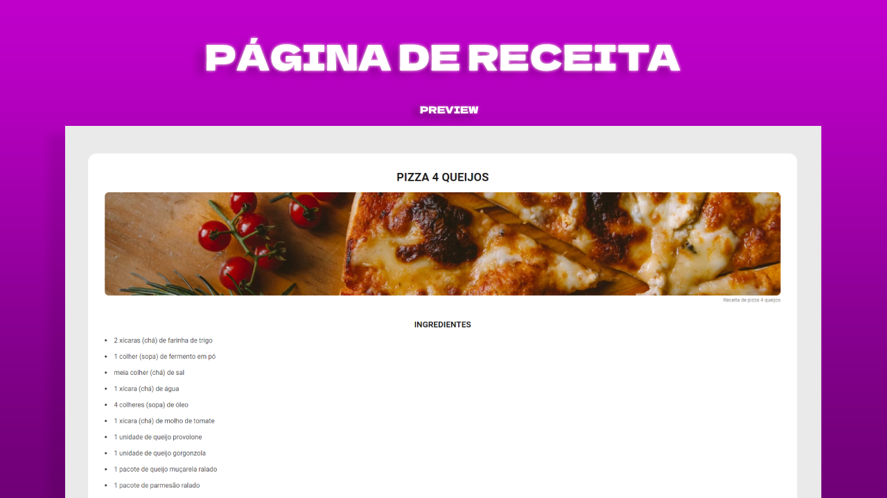

# Projeto de estudos de HTML E CSS

> Página de Receita

Desafio da Rocketseat com o objetivo de criar uma página web de uma receita com título, imagem, lista de ingredientes e modo de preparo.

[🔗 Clique aqui para acessar](https://muroas.github.io/projeto-pagina-de-receita/)

## 🛠️ Tecnologias

- HTML
- CSS

## 📱 Contato

wallacekauandossantos@gmail.com  
https://www.linkedin.com/in/wallace-kauan-4b5427249/